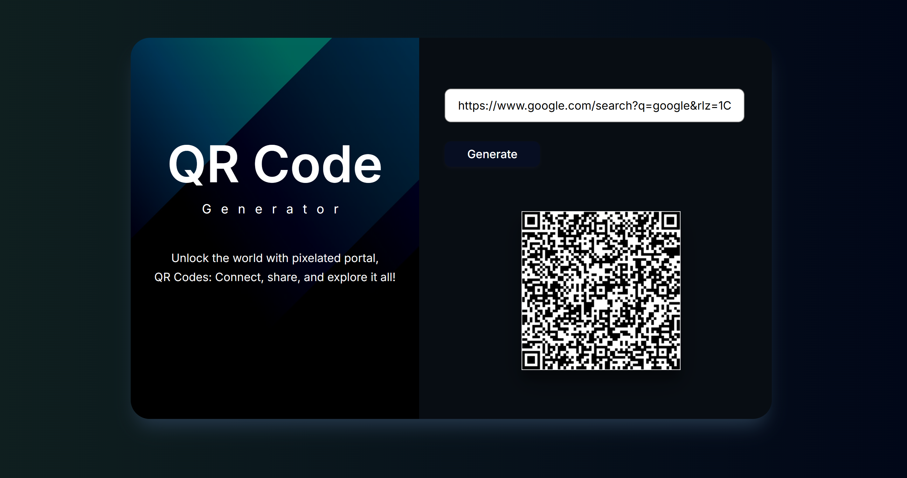

# QR Code Generator using API
****

This project is a lightweight, front-end web application that generates QR codes dynamically using a public API.  
It is built entirely with HTML, CSS, and JavaScript, requiring no backend services. The application enables users to create QR codes instantly by entering text or URLs, which are then processed and rendered in real time.

---

## About

The QR Code Generator project demonstrates how to integrate external APIs into a simple web interface.  
Users can input any text, link, or data, and the app communicates with a QR generation API to fetch and display the corresponding QR code image immediately.  

This project is ideal for students learning web development, developers exploring API integration, or professionals needing a quick QR generation utility.

---

## Features

- Real-time QR code generation from user input.  
- Uses a public API for dynamic QR creation.  
- Simple, responsive, and user-friendly interface.  
- One-click display of the generated QR code.  
- Fully client-side; no backend or database required.  
- Lightweight design suitable for integration into other web projects.

---

## How It Works

1. The user enters text or a URL in the input field.  
2. Upon clicking **Generate QR Code**, the application sends a request to a public QR code generation API.  
3. The API returns a generated QR image based on the provided data.  
4. The image is displayed on the web page for immediate use or download.

---

## Getting Started

### Prerequisites
- A modern web browser (Chrome, Firefox, Edge, Safari).  
- Internet connection (to access the API).

### Installation
```bash
# Clone the repository
git clone https://github.com/Anjana-2004/QR-Code-Generator-using-API.git

# Navigate to the project directory
cd QR-Code-Generator-using-API


### Running the Application

Open the `index.html` file in your preferred browser.
Enter text or a URL in the input box, click **Generate QR Code**, and view the generated image instantly.

---

## Project Structure

```
QR-Code-Generator-using-API/
│
├── index.html        # Main HTML structure
├── style.css         # Styling and layout
├── script.js         # Core logic and API integration
└── README.md         # Project documentation
```

---

## Code Overview

```javascript
// script.js

const qrImage = document.getElementById("qrImage");
const qrText = document.getElementById("qrText");

function generateQR() {
  if (qrText.value.length > 0) {
    const apiURL = `https://api.qrserver.com/v1/create-qr-code/?size=150x150&data=${qrText.value}`;
    qrImage.src = apiURL;
  } else {
    alert("Please enter text or a URL to generate a QR Code.");
  }
}
```

**Explanation:**
This function captures the user input, sends it to the API endpoint, and updates the image source dynamically to display the generated QR code. The API returns a PNG image that can be viewed or downloaded directly.

---

## Customization

You can modify the following aspects based on your preferences:

* **QR Code Size:** Adjust the `size` parameter in the API URL (e.g., `300x300`).
* **Styling:** Update fonts, colors, and layouts in `style.css`.
* **Download Option:** Add a button to download the QR code image:

  ```javascript
  const link = document.createElement("a");
  link.href = qrImage.src;
  link.download = "QRCode.png";
  link.click();
  ```

---

## Future Enhancements

* Add dark and light mode themes.
* Allow custom QR code colors and styles.
* Integrate a logo or watermark inside the QR code.
* Enable offline QR generation using JavaScript libraries such as `qrcode.js`.
* Develop a mobile-responsive PWA (Progressive Web App) version.

---

## Contributing

Contributions are welcome.
If you wish to improve this project:

1. Fork this repository.
2. Create a new branch (`feature-branch`).
3. Commit your changes.
4. Submit a pull request for review.

---

## License

This project is open-source and available under the **MIT License**.
You are free to use, modify, and distribute it with appropriate credit.

---

## Author

**Anjana Satish**
GitHub: [Anjana-2004](https://github.com/Anjana-2004)
Project Link: [QR Code Generator using API](https://github.com/Anjana-2004/QR-Code-Generator-using-API)


